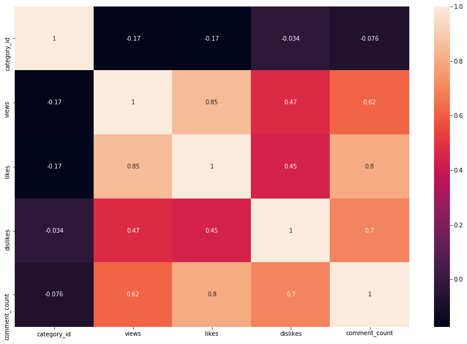
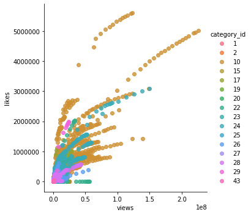
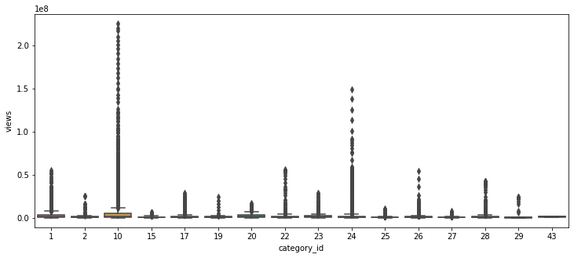
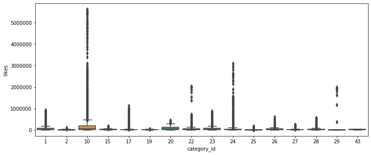
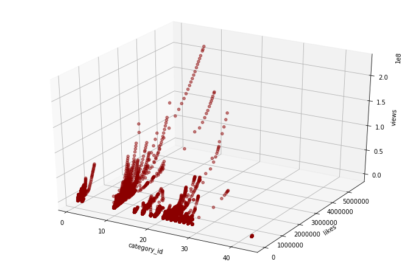

# Trending YouTube Video Statistics(US)

미국의 YouTube 동영상 통계 동향 데이터를 이용하여 사람들이 카테고리 별로 무엇을 더 선호하는지 예측해보자
***

## 데이터 및 라이브러리 출처
- https://www.kaggle.com/datasnaek/youtube-new
- https://github.com/yungbyun/mllib

***
## 과정
- 라이브러리 참조 및 객체 생성
```python
from prediction_util import PredictionUtil
gildong = PredictionUtil()
gildong.read('USvideos.csv')
```

- 컬럼별 유니크한 값의 수
```python
gildong.show_unique_column()
```


- heatmap 그래프
  - 그래프를 보면 views(조회수), likes(좋아요), comment_count(댓글) 컬럼들이 높은 수치를 보여주며 상관관계가 있음을 나타냅니다.
```python
gildong.heatmap(['category_id','views','likes','dislikes','comment_count'])
```


- Implot 그래프
  - 카테고리 별로 조회수와 좋아요 분포를 확인 할 수 있습니다.
```python
gildong.lmplot('views', 'likes', 'category_id')
```


- boxplot 그래프
  - 그래프를 보면 특정 카테고리가 조회수와 좋아요가 많은 것을 알 수 있습니다.
```python
gildong.boxplot('category_id','views')
```

```python
gildong.boxplot('category_id','likes')
```


- plot3d 그래프
  - plot3d 그래프를 보면 몇 개의 카테고리에 동영상만 조회수와 좋아요순이 많은 것을 볼 수 있습니다.
```python
gildong.plot_3d('category_id','likes','views')
```


- 필요없는 컬럼제거
```python
gildong.drop(['video_id','trending_date','channel_title','publish_time','thumbnail_link','comments_disabled','video_error_or_removed','description'])
```

- run_all 함수를 이용하여 조회수를 예측
```python
gildong.run_all(['likes','comment_count','category_id'],'views')
```
